# Diagrama entidad-relación

Este archivo es el código fuente del diagrama de la base de datos. GitHub representa
automáticamente el bloque Mermaid como un diagrama navegable. Las relaciones y campos
reflejan el esquema acumulado de las migraciones `001` a `014`.

```mermaid
erDiagram
    SCHEMA_MIGRATIONS {
        text filename PK
        timestamptz applied_at
    }

    ROLES {
        bigint id PK
        varchar code UK
        varchar name
    }

    PERMISSIONS {
        bigint id PK
        varchar code UK
        varchar name
    }

    ROLE_PERMISSIONS {
        bigint role_id PK, FK
        bigint permission_id PK, FK
    }

    CATEGORIES {
        bigint id PK
        varchar name UK
        bigint parent_id FK
        boolean active
    }

    SUPPLIERS {
        bigint id PK
        varchar code UK
        varchar commercial_name
        varchar tax_id UK
        bigint category_id FK
        varchar country
        boolean active
    }

    USERS {
        bigint id PK
        bigint role_id FK
        bigint supplier_id FK
        varchar email UK
        varchar password_hash
        varchar license_number
        date license_expiry
        integer auth_version
        boolean active
    }

    PASSWORD_RESET_TOKENS {
        bigint id PK
        bigint user_id FK
        varchar token_hash UK
        timestamptz expires_at
        timestamptz used_at
    }

    SUPPLIER_RATINGS {
        bigint id PK
        bigint supplier_id FK
        bigint evaluator_id FK
        numeric punctuality
        numeric quality
        numeric price
        numeric weighted_score
    }

    SUPPLIER_PRODUCTS {
        bigint supplier_id PK, FK
        bigint product_id PK, FK
        numeric unit_price
        varchar supplier_sku
        boolean active
        timestamptz created_at
        timestamptz updated_at
    }

    PRODUCTS {
        bigint id PK
        varchar sku UK
        bigint category_id FK
        varchar name
        integer minimum_stock
        integer maximum_stock
        numeric unit_price
        boolean active
    }

    WAREHOUSES {
        bigint id PK
        varchar code UK
        varchar name
        varchar city
        varchar country
        numeric latitude
        numeric longitude
        boolean active
    }

    STOCKS {
        bigint id PK
        bigint product_id FK
        bigint warehouse_id FK
        integer current_quantity
        integer reserved_quantity
    }

    INVENTORY_MOVEMENTS {
        bigint id PK
        bigint product_id FK
        bigint warehouse_id FK
        bigint user_id FK
        enum movement_type
        varchar reason
        integer quantity
        integer previous_quantity
        integer resulting_quantity
        varchar reference_type
        bigint reference_id
    }

    STOCK_TRANSFERS {
        bigint id PK
        bigint origin_warehouse_id FK
        bigint destination_warehouse_id FK
        bigint created_by FK
        bigint received_by FK
        enum status
        timestamptz received_at
    }

    STOCK_TRANSFER_ITEMS {
        bigint transfer_id PK, FK
        bigint product_id PK, FK
        integer quantity
    }

    PURCHASE_ORDERS {
        bigint id PK
        varchar code UK
        bigint supplier_id FK
        bigint generated_by FK
        bigint approved_by FK
        bigint received_by FK
        bigint received_warehouse_id FK
        enum status
        boolean automatic
        date expected_delivery_date
        timestamptz supplier_confirmed_at
        text supplier_document_url
        timestamptz received_at
    }

    PURCHASE_ORDER_ITEMS {
        bigint purchase_order_id PK, FK
        bigint product_id PK, FK
        integer quantity
        numeric unit_price
    }

    ROUTES {
        bigint id PK
        bigint origin_warehouse_id FK
        bigint destination_warehouse_id FK
        bigint created_by FK
        varchar name
        enum transport_mode
        enum purpose
        jsonb stops
        numeric estimated_distance_km
        numeric estimated_duration_hours
        boolean customs_required
        boolean active
    }

    VEHICLES {
        bigint id PK
        varchar plate UK
        varchar type
        enum transport_mode
        numeric capacity_kg
        numeric capacity_m3
        numeric current_latitude
        numeric current_longitude
        timestamptz last_position_at
        boolean active
    }

    SHIPMENTS {
        bigint id PK
        varchar tracking_code UK
        bigint route_id FK
        bigint purchase_order_id FK, UK
        bigint vehicle_id FK
        bigint driver_id FK
        bigint origin_warehouse_id FK
        bigint destination_warehouse_id FK
        enum flow_type
        enum status
        numeric total_weight_kg
        numeric total_volume_m3
        numeric current_latitude
        numeric current_longitude
        integer delay_minutes
        timestamptz departure_at
        timestamptz eta_at
        timestamptz delivered_at
        timestamptz inventory_reserved_at
        timestamptz inventory_dispatched_at
        timestamptz inventory_received_at
    }

    SHIPMENT_ITEMS {
        bigint shipment_id PK, FK
        bigint product_id PK, FK
        integer quantity
    }

    SHIPMENT_EVENTS {
        bigint id PK
        bigint shipment_id FK
        bigint user_id FK
        enum event_type
        enum status
        enum incident_type
        text description
        numeric latitude
        numeric longitude
        varchar evidence_url
    }

    NOTIFICATIONS {
        bigint id PK
        bigint user_id FK
        varchar title
        enum channel
        varchar event_code
        timestamptz read_at
    }

    NOTIFICATION_PREFERENCES {
        bigint user_id PK, FK
        varchar event_code PK
        boolean app_enabled
        boolean email_enabled
        boolean push_enabled
    }

    MONTHLY_SALES {
        bigint id PK
        bigint category_id FK
        date month
        varchar country
        numeric amount
    }

    AUDIT_LOGS {
        bigint id PK
        bigint user_id FK
        varchar action
        varchar entity_type
        varchar entity_id
        jsonb details
        inet ip_address
    }

    ROLES ||--o{ ROLE_PERMISSIONS : concede
    PERMISSIONS ||--o{ ROLE_PERMISSIONS : contiene
    ROLES ||--o{ USERS : asigna
    SUPPLIERS o|--o{ USERS : vincula
    USERS ||--o{ PASSWORD_RESET_TOKENS : solicita

    CATEGORIES o|--o{ CATEGORIES : agrupa
    CATEGORIES ||--o{ SUPPLIERS : clasifica
    CATEGORIES ||--o{ PRODUCTS : clasifica
    CATEGORIES o|--o{ MONTHLY_SALES : consolida

    SUPPLIERS ||--o{ SUPPLIER_RATINGS : recibe
    USERS ||--o{ SUPPLIER_RATINGS : evalua
    SUPPLIERS ||--o{ SUPPLIER_PRODUCTS : ofrece
    PRODUCTS ||--o{ SUPPLIER_PRODUCTS : pertenece
    SUPPLIERS ||--o{ PURCHASE_ORDERS : atiende
    USERS o|--o{ PURCHASE_ORDERS : genera
    USERS o|--o{ PURCHASE_ORDERS : aprueba
    USERS o|--o{ PURCHASE_ORDERS : recibe
    WAREHOUSES o|--o{ PURCHASE_ORDERS : recepciona
    PURCHASE_ORDERS ||--|{ PURCHASE_ORDER_ITEMS : contiene
    PRODUCTS ||--o{ PURCHASE_ORDER_ITEMS : solicitado
    PURCHASE_ORDERS o|--o| SHIPMENTS : origina

    PRODUCTS ||--o{ STOCKS : dispone
    WAREHOUSES ||--o{ STOCKS : almacena
    PRODUCTS ||--o{ INVENTORY_MOVEMENTS : registra
    WAREHOUSES ||--o{ INVENTORY_MOVEMENTS : ocurre
    USERS ||--o{ INVENTORY_MOVEMENTS : ejecuta

    WAREHOUSES ||--o{ STOCK_TRANSFERS : origen
    WAREHOUSES ||--o{ STOCK_TRANSFERS : destino
    USERS ||--o{ STOCK_TRANSFERS : crea
    USERS o|--o{ STOCK_TRANSFERS : recibe
    STOCK_TRANSFERS ||--|{ STOCK_TRANSFER_ITEMS : contiene
    PRODUCTS ||--o{ STOCK_TRANSFER_ITEMS : transfiere

    WAREHOUSES o|--o{ ROUTES : origen
    WAREHOUSES o|--o{ ROUTES : destino
    USERS ||--o{ ROUTES : crea
    ROUTES ||--o{ SHIPMENTS : planifica
    VEHICLES o|--o{ SHIPMENTS : transporta
    USERS o|--o{ SHIPMENTS : conduce
    WAREHOUSES o|--o{ SHIPMENTS : despacha
    WAREHOUSES o|--o{ SHIPMENTS : recibe
    SHIPMENTS ||--|{ SHIPMENT_ITEMS : contiene
    PRODUCTS ||--o{ SHIPMENT_ITEMS : transportado
    SHIPMENTS ||--o{ SHIPMENT_EVENTS : registra
    USERS o|--o{ SHIPMENT_EVENTS : reporta

    USERS ||--o{ NOTIFICATIONS : recibe
    USERS ||--o{ NOTIFICATION_PREFERENCES : configura
    USERS o|--o{ AUDIT_LOGS : ejecuta
```

## Reglas destacadas

- `stocks` es único por combinación de producto y almacén.
- `purchase_order_items`, `shipment_items` y `stock_transfer_items` usan claves
  compuestas para impedir repetir un producto dentro del mismo documento.
- Una orden de compra puede originar como máximo un envío.
- Los productos de una orden deben pertenecer al catálogo histórico de su proveedor.
- Una entrada de compra exige orden y almacén de destino, y nunca descuenta un
  almacén de origen.
- Una salida de distribución exige un almacén de origen y no puede vincular una
  orden de compra.
- Una ruta específica solo admite envíos de su propósito; `AMBOS` permite los dos
  tipos de flujo.
- La asignación deja el envío `ASIGNADO`; solo la aceptación del conductor inicia
  el viaje y el despacho.
- El vehículo asignado debe estar activo, libre, tener capacidad y utilizar el mismo
  modo de transporte que la ruta.
- Un arribo a almacén queda `PENDIENTE_RECEPCION` y no cambia existencias.
- En una compra transportada, la orden `RECIBIDA` y el envío `ENTREGADO` se
  confirman juntos cuando Inventario acepta físicamente la carga.
- Los movimientos de inventario y registros de auditoría son inmutables.
- Las recepciones, reservas, despachos y entregas se ejecutan dentro de
  transacciones para mantener sincronizadas todas las tablas relacionadas.
- Productos, proveedores, almacenes, rutas, vehículos y usuarios se desactivan
  lógicamente cuando conservan historial asociado.
- `schema_migrations` garantiza que cada archivo SQL se aplique una sola vez y en
  orden lexicográfico.
