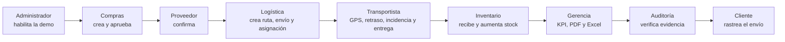
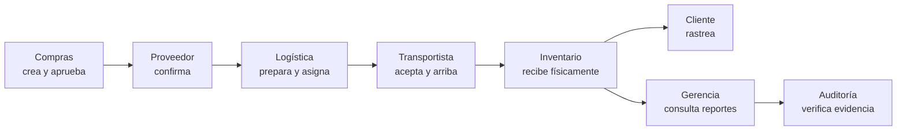

# Guía de demo operativa de SCM Global

La demo operativa no es una presentación de diapositivas. Ejecuta un caso real de
punta a punta usando los mismos endpoints, validaciones, permisos, reportes y tablas
que utiliza la aplicación.

Para que esa automatización no pueda dañar los datos normales, se levanta como una
segunda instalación local totalmente aislada:

| Recurso | Sistema normal | Demo operativa |
|---|---:|---:|
| Web | `http://localhost:8080` | `http://localhost:8081` |
| API | `http://localhost:4000` | `http://localhost:4001` |
| PostgreSQL | `localhost:5435` | `localhost:5436` |
| Proyecto Compose | predeterminado | `scm-global-demo` |
| Volumen de datos | normal | exclusivo de la demo |
| `DEMO_MODE` | `false` | `true` |

El endpoint que entrega las sesiones temporales de los roles se niega a funcionar
si `DEMO_MODE` no está habilitado. También exige que quien inicia el recorrido sea
Administrador. Por ello, la automatización no está disponible accidentalmente en
una instalación normal o productiva.

Todas las cuentas demostrativas usan la contraseña `SCM2026!`.

## 1. Preparación recomendada

Con Docker Desktop iniciado, abra PowerShell en la raíz del repositorio y ejecute:

```powershell
git switch main
git pull --ff-only origin main
powershell -ExecutionPolicy Bypass -File .\iniciar-demo-en-vivo.ps1 -Reiniciar
```

`-Reiniciar` elimina únicamente el volumen aislado de la demo, vuelve a cargar los
datos iniciales y garantiza una presentación reproducible. No detiene ni borra la
instalación normal de `http://localhost:8080`.

Si está desarrollando cambios locales todavía no publicados en las imágenes:

```powershell
powershell -ExecutionPolicy Bypass -File .\iniciar-demo-en-vivo.ps1 -Reiniciar -Build
```

Para detener la demo conservando sus datos:

```powershell
powershell -ExecutionPolicy Bypass -File .\iniciar-demo-en-vivo.ps1 -Detener
```

Para certificar todo el recorrido desde la terminal:

```powershell
$env:SCM_API_URL="http://127.0.0.1:4001/api"
pnpm.cmd verify:demo
```

La comprobación debe finalizar indicando nueve roles, el código de orden, el código
de rastreo, el aumento de stock y la generación de PDF y Excel.

## 2. Ejecución en vivo

1. Abra <http://localhost:8081>.
2. Inicie sesión como `admin@scm.local`.
3. Abra **Demo operativa** en el menú.
4. Opcionalmente active **Pantalla completa**.
5. Pulse **Iniciar flujo completo**.

La pantalla muestra en tiempo real el rol activo, el paso actual, el porcentaje, los
identificadores creados, el stock antes y después, y un registro cronológico. Puede
pausar para explicar un paso, continuar, cambiar la velocidad o detener el
orquestador de forma controlada.

El recorrido ejecuta 18 operaciones reales:

1. Administrador valida usuarios y obtiene sesiones temporales limitadas.
2. Compras consulta el catálogo relacionado con el proveedor.
3. Compras crea una orden con detalle de producto.
4. Compras aprueba la orden.
5. Proveedor confirma la atención y la fecha.
6. Logística crea una ruta correlacionada.
7. Logística crea el envío para la orden.
8. Logística asigna vehículo y conductor compatibles.
9. Transportista acepta la carga.
10. Transportista transmite una posición GPS.
11. Transportista registra un retraso.
12. Transportista registra una incidencia con descripción.
13. Transportista resuelve la incidencia.
14. Transportista confirma la llegada al almacén.
15. Inventario recibe físicamente la orden y aumenta el stock.
16. Gerencia consulta indicadores y genera PDF y Excel.
17. Auditoría comprueba las acciones registradas.
18. Cliente consulta el rastreo público y su historial.



La demo sí crea registros, precisamente porque demuestra el sistema real. La
seguridad proviene del aislamiento, no de fingir las operaciones. Para repetirla,
deténgala y vuelva a iniciarla con `-Reiniciar`.

## 3. Perfiles para la demostración manual

| Turno | Perfil | Usuario | Acción principal |
|---:|---|---|---|
| 1 | Gerencia | `gerente@scm.local` | KPI y reportes iniciales. |
| 2 | Administrador | `admin@scm.local` | Usuarios, roles y demo operativa. |
| 3 | Compras | `compras@scm.local` | Crear y aprobar una orden. |
| 4 | Proveedor | Cuenta del proveedor elegido | Confirmar fecha/documento. |
| 5 | Logística | `logistica@scm.local` | Crear carga y asignar. |
| 6 | Transportista | Conductor libre seleccionado | Aceptar, actualizar y arribar. |
| 7 | Inventario | `inventario@scm.local` | Confirmar recepción. |
| 8 | Cliente | `cliente@scm.local` | Consultar rastreo. |
| 9 | Auditoría | `auditor@scm.local` | Verificar evidencia y acciones. |

Conductores de respaldo:

```text
transportista.libre01@scm.local
transportista.libre02@scm.local
...
transportista.libre08@scm.local
```

Anote durante la presentación:

- código de orden;
- código de rastreo;
- conductor y vehículo;
- cantidades antes y después.

## 4. Historia de la presentación

La empresa solicita productos a un proveedor. Compras aprueba, el proveedor confirma,
Logística prepara y asigna, el conductor acepta y transporta, e Inventario recibe.
Luego se muestra una distribución entre almacenes para explicar reserva y despacho.



## 5. Acto A: situación inicial

### Gerencia

1. Entre como `gerente@scm.local`.
2. Muestre **Dashboard**.
3. Explique ventas, inventario, cargas activas, retrasos y órdenes.
4. Cambie fecha o país y pulse **Actualizar**.
5. Abra **Reportes** y muestre que ambas fechas son obligatorias.

Mensaje sugerido: “Gerencia consulta una sola fuente, pero no altera la operación”.

### Administrador

1. Entre como `admin@scm.local`.
2. Abra **Usuarios**.
3. Filtre por `DRIVER`.
4. Muestre conductores, licencia y estado.
5. Abra **Demo operativa** para explicar el aislamiento y el recorrido real.
6. Active el tema oscuro y muestre contraste en Dashboard, Inventario y Reportes.

## 6. Acto B: compra entrante completa

### Paso 1: Compras crea

1. Entre como `compras@scm.local`.
2. Abra **Órdenes de compra**.
3. Pulse **Nueva orden**.
4. Seleccione un proveedor.
5. Observe que sólo aparecen productos de su catálogo.
6. Agregue uno o dos productos con cantidades pequeñas.
7. Seleccione una fecha futura.
8. Guarde y anote el código.

Estado esperado: `BORRADOR`.

### Paso 2: Compras aprueba

Revise la tarjeta y pulse **Aprobar**.

Estado esperado: `APROBADA`. El stock no cambia.

### Paso 3: proveedor confirma

Use la cuenta que corresponda:

- Andes Tech: `proveedor@scm.local`;
- Brasil Components: `proveedor.brasil@scm.local`;
- Pacífico Foods: `proveedor.pacifico@scm.local`;
- Salud Global: `proveedor.salud@scm.local`.

1. Abra **Portal del proveedor**.
2. Localice la orden.
3. Registre fecha comprometida.
4. La URL del documento puede omitirse o utilizar una URL demostrativa autorizada.
5. Confirme.

Estado esperado: `CONFIRMADA`.

### Paso 4: Logística prepara

1. Entre como `logistica@scm.local`.
2. Abra **Transporte**.
3. Pulse **Nuevo envío**.
4. Elija **Entrada de compra**.
5. Seleccione la orden confirmada.
6. Seleccione una ruta compatible cuyo destino sea el almacén receptor.
7. Indique peso y volumen.
8. Guarde.

Estado esperado: `PREPARANDO`.

### Paso 5: Logística asigna

1. Pulse **Asignar transporte**.
2. Compruebe que sólo aparecen vehículos del mismo modo que la ruta.
3. Seleccione un vehículo con capacidad.
4. Seleccione uno de los ocho conductores libres.
5. Confirme la asignación.

Estado esperado: `ASIGNADO`. Todavía no hay salida ni entrada de inventario.

### Paso 6: conductor acepta

1. Entre con la cuenta del conductor seleccionado.
2. Abra **Transporte**.
3. Verifique que sólo aparece su carga.
4. Pulse **Aceptar carga**.

Resultados:

- envío `EN_TRANSITO`;
- orden `ENVIADA`;
- evento `ACEPTACION`;
- inicio de rastreo.

### Paso 7: conductor informa

Use **Actualizar estado**:

1. publique una ubicación;
2. opcionalmente registre retraso o incidencia;
3. si registra incidencia, seleccione el tipo y describa el problema;
4. registre `ARRIBO` al almacén.

Estado esperado: `PENDIENTE_RECEPCION`. El stock todavía no aumenta.

### Paso 8: Inventario recibe

1. Entre como `inventario@scm.local`.
2. Abra **Órdenes de compra** o **Transporte**.
3. Localice la carga pendiente.
4. Pulse **Confirmar recepción**.

Resultados:

- envío `ENTREGADO`;
- orden `RECIBIDA`;
- movimiento `ENTRADA/COMPRA`;
- stock destino aumentado;
- usuario y fecha de recepción registrados.

## 7. Acto C: distribución entre almacenes

### Logística

1. Entre como `logistica@scm.local`.
2. Abra **Transporte → Nuevo envío**.
3. Seleccione **Salida de distribución**.
4. Elija ruta entre almacenes.
5. Seleccione un producto con disponibilidad.
6. Use una cantidad pequeña.
7. Guarde.

Al crear:

```text
current_quantity = sin cambio
reserved_quantity += cantidad
status = PREPARANDO
```

Asigne vehículo del mismo modo y conductor libre:

```text
status = ASIGNADO
stock físico = sin cambio
```

### Transportista

Al aceptar:

```text
current_quantity -= cantidad
reserved_quantity -= cantidad
movimiento = SALIDA / DESPACHO
status = EN_TRANSITO
```

Registre arribo:

```text
status = PENDIENTE_RECEPCION
stock destino = sin cambio
```

### Inventario

Confirme recepción:

```text
stock destino += cantidad
movimiento = ENTRADA / TRASLADO_ENVIO
status = ENTREGADO
```

## 8. Acto D: visibilidad

### Cliente

1. Entre como `cliente@scm.local` o abra el rastreo público.
2. Escriba parte del código.
3. Seleccione una coincidencia.
4. Muestre estado, ETA, ubicación, carga y eventos.
5. Explique que no puede abrir módulos internos.

### Mapa global

Como Logística o Administrador:

1. abra **Mapa global**;
2. seleccione un envío;
3. compruebe que el mapa se acerca a su ubicación;
4. observe frescura, retraso e incidencia.

### Gerencia

1. Abra **Reportes**.
2. Seleccione ambas fechas.
3. Exporte PDF.
4. Exporte Excel.
5. Explique filtros y trazabilidad.

### Auditor

1. Entre como `auditor@scm.local`.
2. Abra **Reportes → Auditoría**.
3. Busque las acciones ejecutadas.
4. Muestre usuario, entidad, fecha y detalle.

## 9. Puntos que deben quedar claros

- Ningún rol completa solo todo el flujo.
- El proveedor confirma antes del transporte.
- Logística asigna, pero el conductor acepta.
- Arribar no equivale a recibir inventario.
- Inventario confirma físicamente.
- Reserva y stock actual tienen significados diferentes.
- Ruta y vehículo siempre usan el mismo modo.
- Los movimientos y la auditoría son inmutables.
- La telemetría es demostrativa, no un GPS físico.
- Aduana, ERP y correo externo requieren integraciones reales.

## 10. Recuperación durante una presentación

### No aparecen conductores

1. Compruebe que migración `014` esté aplicada.
2. Use una cuenta `transportista.libreXX`.
3. Verifique licencia vigente y ausencia de otra carga activa.

### No aparecen vehículos

Compruebe modo de ruta, capacidad, estado activo y ausencia de otra carga activa.

### No aparece la orden para Logística

Debe estar `CONFIRMADA`, tener productos de catálogo y no tener otro envío.

### No aparece recepción

El conductor debe haber aceptado y registrado `ARRIBO`.

### No hay ubicación en vivo

```powershell
docker compose restart telemetry-demo
docker compose logs -f telemetry-demo
```

Espere hasta 15 segundos.

## 11. Reiniciar datos

La demo operativa crea datos reales en su volumen aislado. Para repetir exactamente
el mismo caso:

```powershell
powershell -ExecutionPolicy Bypass -File .\iniciar-demo-en-vivo.ps1 -Detener
powershell -ExecutionPolicy Bypass -File .\iniciar-demo-en-vivo.ps1 -Reiniciar
```

Estos comandos no tocan el volumen ni los contenedores del sistema normal.

Para una base manual descartable, primero confirme que no existen datos importantes:

```powershell
docker compose down -v
powershell -ExecutionPolicy Bypass -File .\iniciar-scm.ps1
```

Este comando elimina permanentemente la base local. Para ensayos seguros se recomienda
`probar-instalacion-limpia.ps1 -Build`, que usa un volumen aislado.
