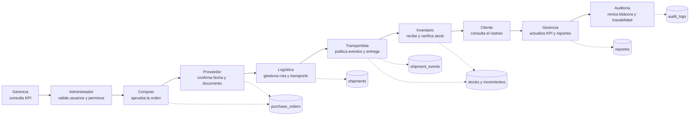

# Guía de presentación integral de SCM Global

Esta guía propone una demostración de 20 a 30 minutos en la que participan los nueve
perfiles del sistema. El recorrido utiliza los datos iniciales del proyecto y continúa
con una distribución entre almacenes para mostrar el ciclo completo de la cadena de
suministro.

## 1. Preparación

Abra Docker Desktop y espere a que el motor indique que está listo. Desde la terminal
integrada de Visual Studio Code:

```powershell
cd "C:\Users\Rolando Muñoz\Desktop\proyecto-taller"
powershell -ExecutionPolicy Bypass -File .\iniciar-scm.ps1
docker compose ps
pnpm verify:system
```

Los servicios `frontend`, `backend` y `postgres` deben aparecer como `healthy`. La
migración debe figurar como `Exited (0)`.

Direcciones:

- Aplicación: <http://localhost:8080>
- API: <http://localhost:4000/api/health>
- Rastreo inicial: <http://localhost:8080/rastreo/SCM-BO-2026-001>

Todos los usuarios demostrativos usan la contraseña `SCM2026!`.

| Turno | Perfil | Usuario | Papel en la demostración |
|---:|---|---|---|
| 1 | Gerencia | `gerente@scm.local` | Presenta la situación inicial y los KPI. |
| 2 | Administrador | `admin@scm.local` | Demuestra usuarios, roles y permisos. |
| 3 | Compras | `compras@scm.local` | Gestiona proveedor y orden de compra. |
| 4 | Proveedor | `proveedor@scm.local` | Confirma fecha y documento de la orden. |
| 5 | Cliente | `cliente@scm.local` | Consulta el rastreo sin acceder a módulos internos. |
| 6 | Logística | `logistica@scm.local` | Supervisa ruta, flota y envío. |
| 7 | Transportista | `transportista@scm.local` | Publica eventos y confirma la entrega. |
| 8 | Inventario | `inventario@scm.local` | Comprueba movimientos y cambio de existencias. |
| 9 | Auditoría | `auditor@scm.local` | Cierra el recorrido con trazabilidad y evidencia. |

Conviene cerrar sesión antes de cambiar de perfil. Mantenga anotados los códigos de
orden y rastreo que genere durante la demostración.

## 2. Historia que se presentará

La empresa compra controladores de temperatura a **Andes Tech Supply**. El proveedor
confirma la orden, Logística transporta la compra al almacén de Lima y el
Transportista entrega la carga. Inventario verifica la entrada. Después, la empresa
distribuye una pequeña cantidad desde La Paz hacia Lima, mostrando reserva, despacho,
seguimiento y recepción entre almacenes.



## 3. Acto A: compra entrante ya preparada

Este acto utiliza:

- Orden: `OC-2026-0001`.
- Proveedor: `PRV-0001 · Andes Tech Supply`.
- Producto: `ELEC-002 · Controlador de temperatura`.
- Cantidad: `110`.
- Envío: `SCM-BO-2026-001`.
- Ruta: `La Paz - Lima`.
- Vehículo: `BO-TRK-101`.

### Paso 1: Gerencia establece la línea base

1. Inicie sesión como `gerente@scm.local`.
2. Muestre **Dashboard** y explique ventas, valor de inventario, envíos activos,
   órdenes pendientes y mejor proveedor.
3. Abra **Reportes** para destacar que Gerencia consulta y exporta, pero no altera
   la operación.

Mensaje para la exposición: “La dirección ve una sola versión consolidada de la
operación antes de tomar decisiones”.

### Paso 2: Administración demuestra el control de acceso

1. Inicie sesión como `admin@scm.local`.
2. Abra **Usuarios**.
3. Muestre que existen nueve roles y que cada cuenta tiene permisos diferentes.
4. Explique que todas las acciones relevantes quedan vinculadas al usuario autenticado.

Dato observado: `users`, `roles`, `permissions` y `role_permissions`.

### Paso 3: Compras gestiona proveedor y orden

1. Inicie sesión como `compras@scm.local`.
2. Abra **Proveedores** y seleccione **Andes Tech Supply**.
3. Muestre las calificaciones de puntualidad, calidad y precio.
4. Abra **Órdenes de compra** y localice `OC-2026-0001`.
5. Explique sus productos, cantidades, fecha esperada y estado aprobado.

Datos conectados:

```text
supplier PRV-0001
  -> purchase_order OC-2026-0001
     -> purchase_order_items
        -> product ELEC-002
```

### Paso 4: el Proveedor confirma el compromiso

1. Inicie sesión como `proveedor@scm.local`.
2. Abra **Portal proveedor**.
3. Localice `OC-2026-0001` y pulse **Confirmar**.
4. Seleccione una fecha futura y use como documento demostrativo
   `https://example.com/confirmacion-oc-2026-0001.pdf`.
5. Confirme que el proveedor solo ve sus propias órdenes.

Cambio esperado:

```text
purchase_orders.status = CONFIRMADA
supplier_confirmed_at = fecha y hora actual
supplier_document_url = documento informado
```

### Paso 5: el Cliente consulta antes de la entrega

1. Inicie sesión como `cliente@scm.local`, o abra directamente **Rastreo público**.
2. Consulte `SCM-BO-2026-001`.
3. Muestre ubicación, ETA, ruta y la línea de tiempo existente.
4. Destaque que el Cliente no puede ingresar a inventarios, compras ni administración.

### Paso 6: Logística muestra la torre de control

1. Inicie sesión como `logistica@scm.local`.
2. En **Rutas**, muestre `La Paz - Lima`, su propósito **Uso mixto**, distancia,
   duración y paso aduanero.
3. En **Transporte**, abra `SCM-BO-2026-001`.
4. Muestre vehículo, conductor, peso, volumen, ubicación, estado y ETA.
5. Abra **Mapa global** para explicar la visibilidad geográfica.

### Paso 7: el Transportista actualiza y entrega

1. Inicie sesión como `transportista@scm.local`.
2. Abra el envío asignado `SCM-BO-2026-001`.
3. Registre primero un evento **Aduana** con una descripción como
   `Control aduanero completado sin observaciones`.
4. Muestre en otra pestaña cómo el rastreo incorpora el evento.
5. Registre finalmente **Entrega**, usando como descripción
   `Carga recibida y documento firmado en Centro Lima`.
6. Puede usar `https://example.com/evidencia-entrega-demo.jpg` como evidencia.

La entrega ejecuta una sola transacción:

```text
shipment.status = ENTREGADO
purchase_order.status = RECIBIDA
stocks[Centro Lima, ELEC-002] += 110
inventory_movements += ENTRADA / COMPRA
shipment_events += ENTREGA
```

### Paso 8: Inventario valida el resultado

1. Inicie sesión como `inventario@scm.local`.
2. Abra **Inventario** y filtre el almacén **Centro Lima**.
3. Busque `ELEC-002` y muestre la existencia actualizada.
4. Abra sus movimientos y localice la entrada relacionada con la compra.
5. Use **Trazabilidad de producto** para relacionar proveedor, orden, envío y stock.

Mensaje para la exposición: “La entrega logística y la recepción contable del
inventario son atómicas; no puede quedar el envío entregado sin que se registre el
stock”.

## 4. Acto B: distribución entre almacenes

Este segundo acto demuestra reserva, salida y entrada entre almacenes.

### Paso 9: Inventario identifica disponibilidad

1. Con `inventario@scm.local`, abra **Inventario**.
2. Seleccione **Centro La Paz**.
3. Elija un producto con al menos dos unidades disponibles y anote su SKU y cantidad.

### Paso 10: Logística crea y asigna la distribución

1. Inicie sesión como `logistica@scm.local`.
2. Abra **Transporte** y pulse **Nuevo envío**.
3. Seleccione **Salida de distribución**.
4. Use la ruta `La Paz - Lima`.
5. Seleccione **Centro La Paz** como origen y **Centro Lima** como destino.
6. Agregue dos unidades del producto anotado.
7. Use `250 kg` y `2 m³` como carga demostrativa.
8. Guarde y anote el nuevo código de rastreo.

Al crear el envío:

```text
current_quantity = sin cambio
reserved_quantity += 2
available_quantity -= 2
```

9. Asigne un vehículo terrestre disponible y a
   `transportista@scm.local`.

Al asignarlo:

```text
current_quantity -= 2
reserved_quantity -= 2
inventory_movements += SALIDA / DESPACHO
shipment.status = EN_TRANSITO
```

### Paso 11: Transportista y Cliente siguen la distribución

1. Inicie sesión como `transportista@scm.local`.
2. Abra el nuevo envío y publique una **Ubicación** o **Escala**.
3. Como `cliente@scm.local`, consulte el código de rastreo y muestre el nuevo evento.
4. Regrese al Transportista y publique **Entrega**.
5. Actualice el rastreo para mostrar el estado final.

Si el destino es **Centro Lima**:

```text
stocks[Centro Lima, producto] += 2
inventory_movements += ENTRADA / TRASLADO_ENVIO
shipment.status = ENTREGADO
```

## 5. Cierre ejecutivo y auditor

### Paso 12: Gerencia comprueba el impacto

1. Inicie sesión como `gerente@scm.local`.
2. Actualice **Dashboard**.
3. Abra **Reportes** y filtre por proveedor, producto, país o período.
4. Muestre las opciones de exportación PDF y Excel.

### Paso 13: Auditoría demuestra la evidencia

1. Inicie sesión como `auditor@scm.local`.
2. Abra **Reportes → Auditoría**.
3. Localice las acciones `SUPPLIER_CONFIRM`, asignación, eventos del envío y entrega.
4. Abra **Trazabilidad de producto** para enseñar el recorrido cronológico.
5. Explique que Auditoría consulta y exporta, pero no puede modificar inventario,
   compras ni transporte.

Frase de cierre sugerida:

> “SCM Global no solo mueve datos entre módulos: conserva quién realizó cada acción,
> conecta la operación física con el inventario y ofrece una visión distinta y segura
> para cada participante”.

## 6. Matriz del flujo de datos

| Acción | Responsable | Datos principales | Resultado visible |
|---|---|---|---|
| Revisar KPI | Gerencia | ventas, órdenes, stock, envíos | Dashboard inicial |
| Administrar accesos | Administrador | usuarios, roles, permisos | Separación de funciones |
| Gestionar compra | Compras | proveedor, orden, productos | Orden aprobada |
| Confirmar orden | Proveedor | fecha, documento | Orden confirmada |
| Preparar transporte | Logística | ruta, almacenes, vehículo | Envío asignado |
| Reportar recorrido | Transportista | ubicación, aduana, evidencia | Seguimiento en tiempo real |
| Entregar compra | Transportista | evento de entrega | Orden recibida y entrada de stock |
| Verificar inventario | Inventario | stock y movimientos | Existencia conciliada |
| Consultar rastreo | Cliente | código y eventos públicos | ETA y estado sin acceso interno |
| Analizar resultado | Gerencia | KPI y reportes | Decisión ejecutiva |
| Revisar evidencia | Auditoría | bitácora y trazabilidad | Control verificable |

## 7. Modo desarrollo desde Visual Studio Code

Para trabajar con recarga automática, use:

```powershell
cd "C:\Users\Rolando Muñoz\Desktop\proyecto-taller"
powershell -ExecutionPolicy Bypass -File .\iniciar-desarrollo.ps1
```

Este iniciador:

1. Detiene solamente el frontend y backend de Docker para liberar sus puertos.
2. Conserva PostgreSQL y todos los datos.
3. Aplica migraciones pendientes.
4. Carga las variables de `.env`.
5. Inicia backend y frontend desde el código local.

Direcciones de desarrollo:

- Frontend: <http://localhost:5173>
- API: <http://localhost:4000/api>

Para detener el modo desarrollo, pulse `Ctrl+C`. Para regresar al modo Docker:

```powershell
powershell -ExecutionPolicy Bypass -File .\iniciar-scm.ps1
```

## 8. Reiniciar los datos de demostración

Solo si desea borrar todos los cambios realizados durante los ensayos y recuperar los
datos iniciales:

```powershell
docker compose down -v
powershell -ExecutionPolicy Bypass -File .\iniciar-scm.ps1
```

`docker compose down -v` elimina permanentemente la base de datos local del proyecto.
No lo utilice si desea conservar datos reales o información creada durante la
presentación.
